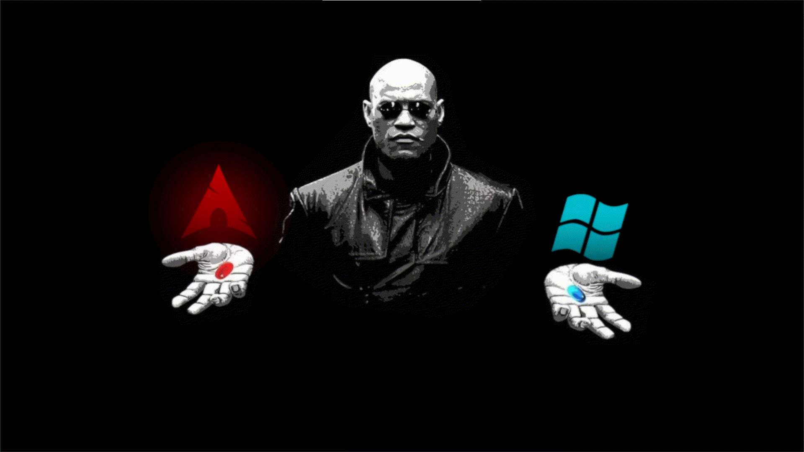

# Matrix Morpheus GRUB Theme
**Red Pill vs Blue Pill**

A minimalist Matrix-inspired GRUB theme featuring full-screen dynamic backgrounds that change between Linux and Windows.

---

⚠️ **Note:**  
Currently, the theme only includes the **Arch Linux** icon.  
 
Also, while the icons are **arranged horizontally** on screen,  
you still navigate using the **Up** and **Down arrow keys** as in a normal GRUB menu.

---

## Installation

1. Clone the repo

```shell
git clone https://github.com/Priyank-Adhav/Matrix-Morpheus-GRUB-Theme
```

2. Go into the folder 

```shell
cd Matrix-Morpheus-GRUB-Theme
```

3. Make the installer executable

```shell
chmod +x install.sh
```

4. Execute the installation script as admin

```shell
sudo ./install.sh
```

5. Reboot to test your new theme
