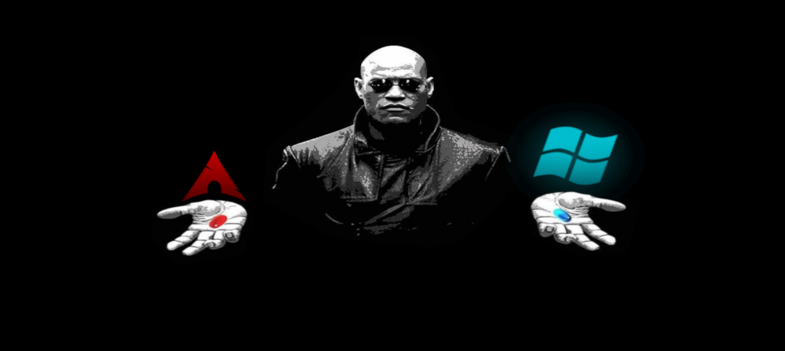

# Matrix Morpheus GRUB Theme
Red Pill vs Blue Pill.

A minimalist Matrix-inspired GRUB theme featuring full-screen dynamic backgrounds that change between Linux and Windows.


## Installation

1. Clone the repo

```shell
git clone https://github.com/Priyank-Adhav/Matrix-GRUB-Theme
```

2. Go into the folder 

```shell
cd Matrix-GRUB-Theme
```

3. Execute the installation script as admin

```shell
sudo ./install.sh
```

3. Reboot to test your new theme
